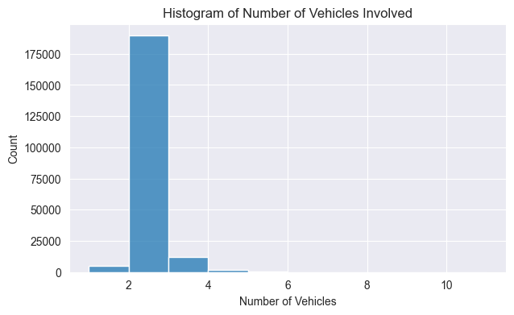
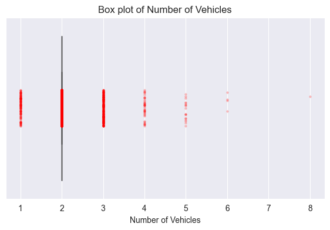
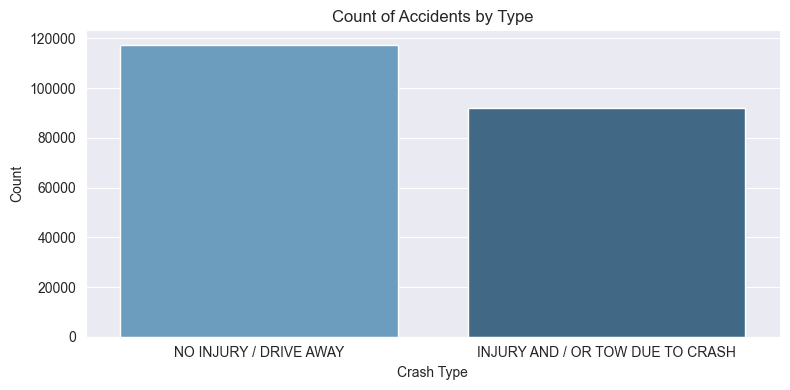
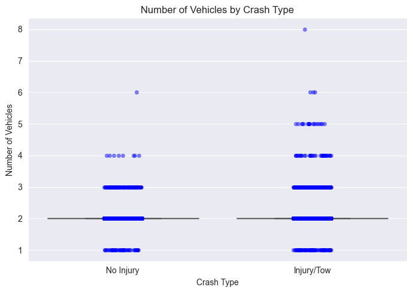
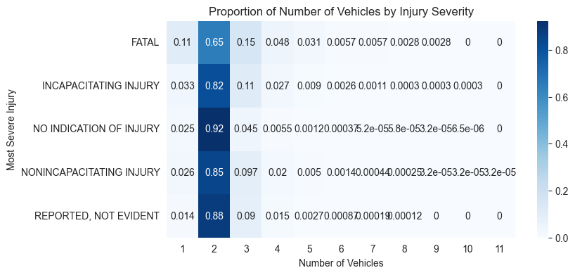
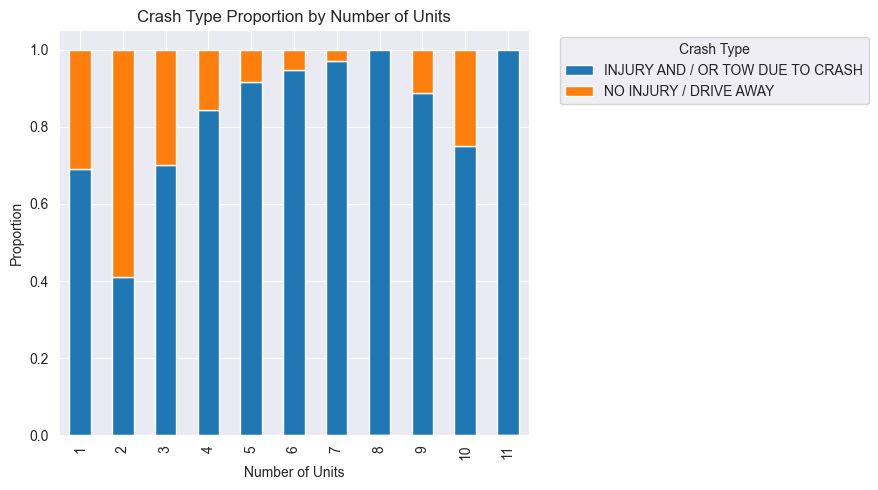
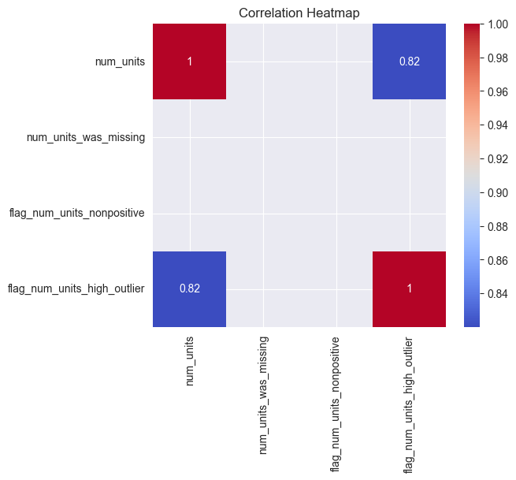
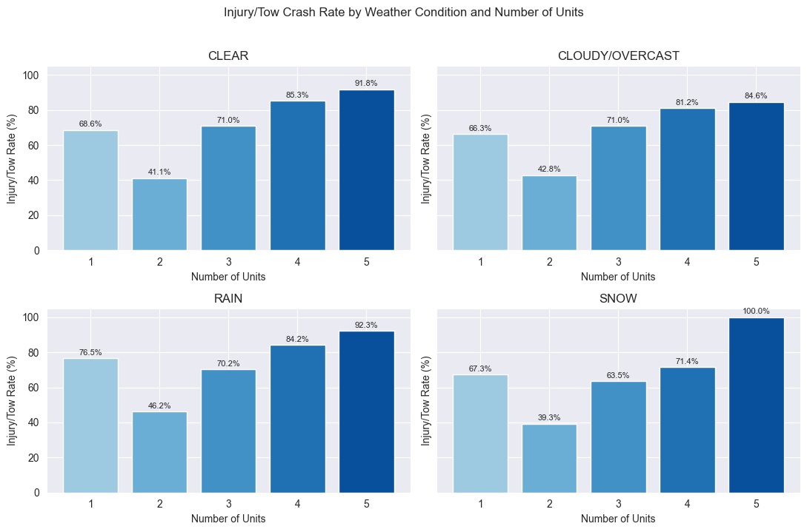
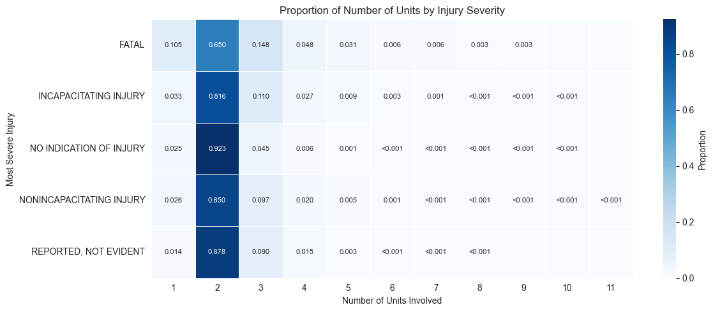

# M4 Exploratory Data Analytics Report

## Traffic Accidents Dataset

### Introduction

This report presents an exploratory data analysis (EDA) of the cleaned traffic accidents dataset. The purpose of this milestone is to understand the structure of the dataset, identify important patterns, evaluate potential modelling risks, and refine the modelling question for the next stage of the project. The EDA focuses on accident characteristics such as crash type, number of units involved, injury severity, weather condition, lighting condition, roadway condition, and traffic control device.

The analysis follows a structured EDA workflow. First, the dataset is profiled to confirm its size, variable types, and missing-data status. Second, univariate analysis is used to understand individual variables. Third, bivariate and multivariate analyses are used to explore relationships between accident characteristics and outcomes. Finally, the initial hypotheses are revised based on the evidence revealed by the EDA.

---

## Dataset Overview and Data Quality

The cleaned dataset contains 209,275 records and 17 columns. Each row represents one traffic accident record. The dataset has no missing values after cleaning, making it suitable for EDA and later modelling. Most variables are categorical, including `traffic_control_device`, `weather_condition`, `lighting_condition`, `first_crash_type`, `trafficway_type`, `roadway_surface_cond`, `crash_type`, and `most_severe_injury`. The main numeric variable is `num_units`, which records the number of traffic units involved in each crash.

| Item | Value |
|------|-------|
| Number of records | 209,275 |
| Number of columns | 17 |
| Missing values | 0 |
| Main numeric variable | `num_units` |
| Main outcome candidates | `crash_type`, `most_severe_injury` |
| Data quality flags | `flag_num_units_high_outlier`, `num_units_was_missing` |

The cleaned dataset also contains several engineered data-quality indicators. For example, `flag_num_units_high_outlier` identifies crashes with unusually high numbers of units. These flags are useful for checking data quality, but they must be interpreted carefully during modelling because some of them are directly derived from other variables.

---

## Univariate Analysis

  

**Interpretation:** Figure 1 shows that most crashes involve two units, while crashes involving more than three units are rare. This indicates that `num_units` is highly concentrated around two-unit crashes.

  

**Interpretation:** Figure 2 confirms that the typical crash involves two units. The additional points represent less common crashes involving one unit or more than two units, suggesting that high-unit crashes are unusual events.

  

**Interpretation:** Figure 3 shows that `NO INJURY / DRIVE AWAY` crashes are more common than `INJURY AND / OR TOW DUE TO CRASH`. This class imbalance may affect later modelling because a model could perform well on the majority class while missing more serious crashes.

  

**Interpretation:** Figure 4 shows that most accidents occur under clear weather conditions, while rain, cloudy/overcast, and snow conditions are much less frequent. This suggests that raw accident counts should not be interpreted as direct weather risk, because common weather conditions naturally appear more often in the dataset.

---

## Bivariate Analysis

  

**Interpretation:** Figure 5 compares the distribution of `num_units` across crash types. Both crash types are centred around two units, but the injury/tow category shows a longer upper tail, indicating that more severe crashes are somewhat more likely to involve additional units.

  

**Interpretation:** Figure 6 supports this finding numerically. The median number of units is approximately two for both crash types, but the mean is slightly higher for `INJURY AND / OR TOW DUE TO CRASH`, suggesting that additional units are more common in more serious crash outcomes.

  

**Interpretation:** Figure 7 shows that crash type proportions vary across weather conditions. Rain has the highest share of `INJURY AND / OR TOW DUE TO CRASH`, suggesting that weather condition may be associated with crash severity and should be considered in later modelling.

  

**Interpretation:** Figure 8 shows the Injury/Tow crash rate for each weather condition. Rain has the highest Injury/Tow rate, followed by cloudy/overcast, clear, and snow conditions, indicating that adverse weather may increase the likelihood of more serious crash outcomes.

---

## Multivariate Analysis

  

**Interpretation:** Figure 9 shows how crash-type proportions change as the number of units involved increases. Crashes with higher unit counts tend to have a larger share of `INJURY AND / OR TOW DUE TO CRASH`, suggesting that multi-unit crashes are more likely to result in injury or towing.

  

**Interpretation:** Figure 10 shows a strong positive correlation between `num_units` and `flag_num_units_high_outlier`. This is expected because the flag is derived from unusually high values of `num_units`, so engineered flags should be checked for redundancy before modelling.

  

**Interpretation:** Figure 11 shows that Injury/Tow rates generally increase as the number of units involved rises across different weather conditions. This suggests that crash severity may depend on both environmental conditions and multi-unit involvement rather than a single factor.

  

**Interpretation:** Figure 12 shows that two-unit crashes dominate every injury severity category. Fatal crashes have relatively higher proportions of one-unit and three-unit crashes compared with no-injury crashes, suggesting that injury severity is influenced by multiple factors rather than by unit count alone.

---

## Revised Hypotheses

| Initial Hypothesis | EDA Finding | Revised Hypothesis |
|-------------------|-------------|------------------|
| Crashes involving more units are more severe. | Most crashes involve two units across all severity levels, but Injury/Tow rates tend to increase when more units are involved. | `num_units` may contribute to injury severity, but it must be combined with crash type and environmental features. |
| Crash type is associated with the number of units involved. | Both crash types have a median of two units, but the injury/tow group has a slightly higher mean and longer tail. | More serious crash types are somewhat more likely to involve additional units, but the relationship is modest. |
| Weather condition is associated with crash severity. | Rain has the highest Injury/Tow crash rate, and crash-type proportions vary across weather conditions. | Weather condition may help explain crash severity and should be included as a modelling feature. |
| Engineered flags can directly improve modelling. | `flag_num_units_high_outlier` is strongly related to `num_units`. | Engineered flags should be checked for redundancy before being used as model features. |
| Crash outcomes can be explained by a single accident feature. | No single variable fully explains crash type or injury severity. | Crash outcomes should be modelled using multiple features, including unit count, crash context, weather, lighting, road surface, and traffic control. |

---

## Modelling Question

Based on the EDA, the modelling question the team will pursue is:

> Can we predict whether a traffic accident results in `INJURY AND / OR TOW DUE TO CRASH` using features such as number of units involved, traffic control device, weather condition, lighting condition, roadway surface condition, intersection status, and primary contributory cause?

---

## Conclusion

The EDA shows that most traffic accidents in the cleaned dataset involve two units and fall into the no-injury/drive-away category. Injury/tow crashes show slightly higher average numbers of units and a longer upper tail. Weather condition also appears to be associated with crash severity, with rainy conditions showing the highest Injury/Tow crash rate among the analysed weather categories. Overall, crash severity is influenced by multiple factors, including number of units, crash type, environmental conditions, roadway characteristics, and traffic-control context. The next stage should focus on building a classification model for `crash_type` while carefully handling class imbalance and avoiding redundant features.