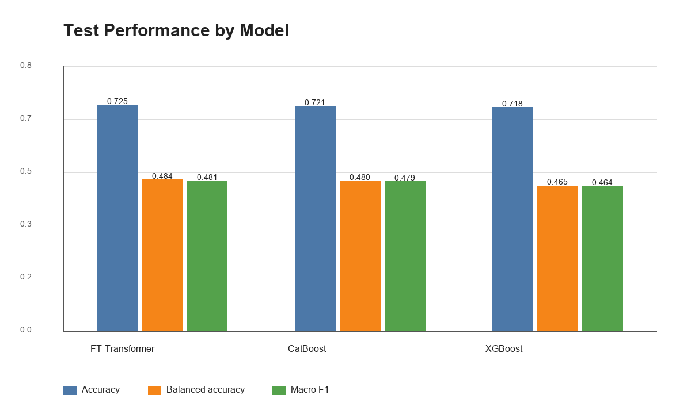
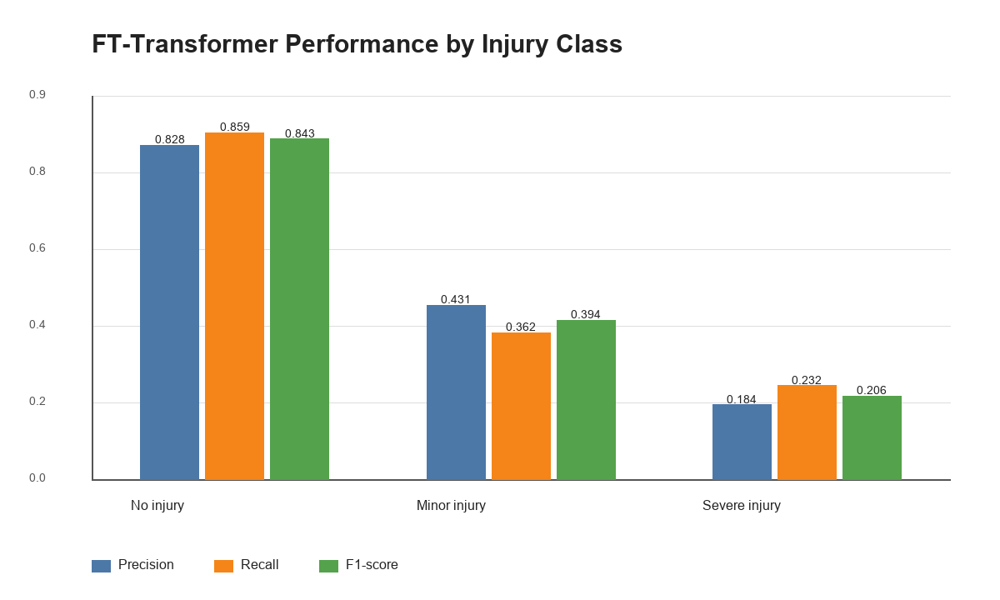
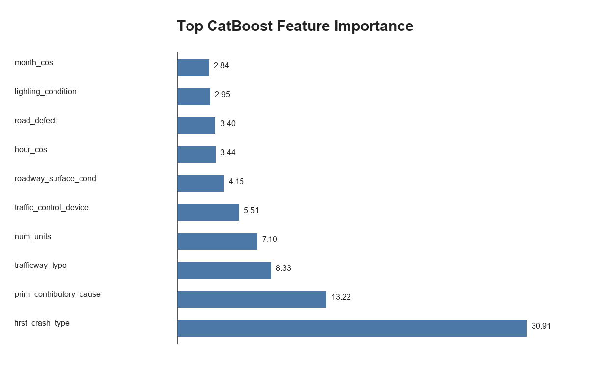
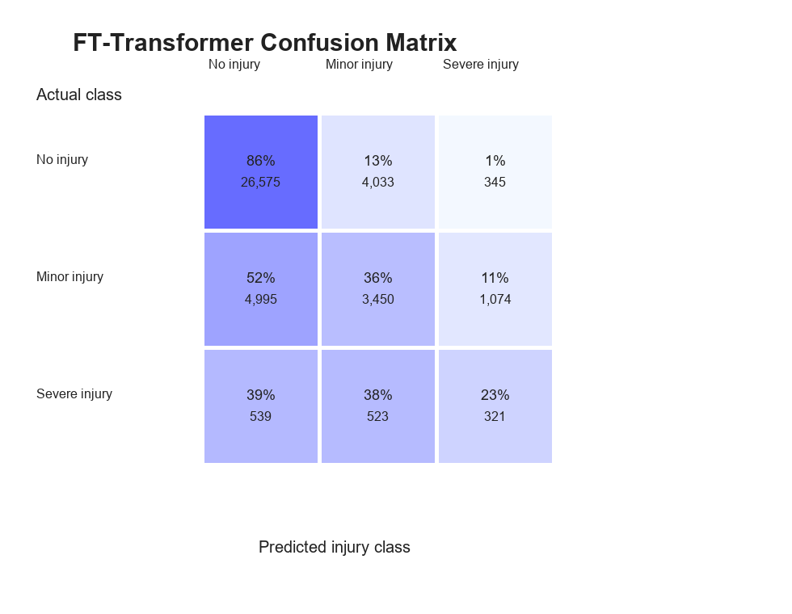

# M5 Data Modelling & Visualisation Report

## 1. Introduction

This report presents the modelling and evaluation work for predicting traffic accident injury severity. Building on the cleaned and model-ready datasets from M2/M3 and the exploratory findings from M4, the M5 work focuses on training multiple classification models, comparing their performance with imbalance-aware metrics, and translating the results into stakeholder-facing visualisations.

The modelling target is `most_severe_injury`. An early version of the modelling task kept the original five injury labels, but the labels were too imbalanced for reliable multi-class learning. In particular, the fatal-injury class was extremely small and produced unstable class-level metrics. For the final M5 pipeline, the target was therefore simplified into three operational classes:

| Original injury categories | M5 modelling class |
|---|---|
| `NO INDICATION OF INJURY` | `NO_INJURY` |
| `REPORTED, NOT EVIDENT`; `NONINCAPACITATING INJURY` | `MINOR_INJURY` |
| `INCAPACITATING INJURY`; `FATAL` | `SEVERE_INJURY` |

This three-class structure keeps the task interpretable for decision makers while avoiding an extremely sparse five-class fatal-injury category. It also matches a practical operational interpretation: no apparent injury, non-severe injury, and severe or fatal injury. The final goal is not to replace crash investigation, but to estimate which recorded accident conditions are associated with higher injury severity risk.

The M5 deliverables are implemented in four notebooks:

| Notebook | Purpose |
|---|---|
| `m5_data_preprocessing.ipynb` | Creates the M5 train/test modelling datasets and metadata. |
| `m5_model_training.ipynb` | Trains and evaluates CatBoost, XGBoost, and FT-Transformer models. |
| `m5_report_visualizations.ipynb` | Generates the visualisations used in this report from saved model outputs. |
| `m5_prediction_interface.ipynb` | Demonstrates how the selected model can be loaded and used for prediction. |

---

## 2. Data Preparation

The M5 pipeline starts from the processed traffic accident records. The raw dataset contained 209,306 rows, and 31 exact duplicate records were removed. The final modelling dataset contains 209,275 records.

The data was split using a stratified random train/test split so that the injury class distribution was preserved in both sets.

| Split | Rows | Share |
|---|---:|---:|
| Training | 167,420 | 80% |
| Test | 41,855 | 20% |

The final three-class target was still highly imbalanced after aggregation.

| Class | Train rows | Test rows | Test share |
|---|---:|---:|---:|
| `NO_INJURY` | 123,814 | 30,953 | 74.0% |
| `MINOR_INJURY` | 38,075 | 9,519 | 22.7% |
| `SEVERE_INJURY` | 5,531 | 1,383 | 3.3% |

This distribution explains why the project did not rely on accuracy alone. A model can achieve a high accuracy by mostly predicting `NO_INJURY`, while still missing many severe-injury cases.

The model uses accident-context predictors such as traffic control device, weather condition, lighting condition, first crash type, trafficway type, roadway surface condition, intersection status, primary contributory cause, number of units, crash hour, crash month, and weekend/time-cycle features.

Several columns were deliberately excluded to reduce target leakage:

| Excluded column group | Reason |
|---|---|
| `crash_type`, `damage` | These describe downstream crash outcomes too directly. |
| `injuries_total`, `injuries_fatal`, `injuries_incapacitating`, `injuries_non_incapacitating`, `injuries_reported_not_evident`, `injuries_no_indication` | These are direct or near-direct components of the injury severity target. |

Categorical predictors were represented in two ways. CatBoost used categorical columns directly, while XGBoost used one-hot encoded features. The FT-Transformer-style model used categorical embeddings and scaled numeric inputs. Rare categorical levels below the training-frequency threshold were grouped into `OTHER_RARE` so that very small categories did not create unstable one-hot columns or embedding entries.

---

## 3. Model Choices and Rationale

Three models were trained and compared.

| Model | Rationale |
|---|---|
| CatBoost | CatBoost is well suited for tabular data with many categorical predictors. It can use categorical feature handling directly and provides useful feature importance outputs. This makes it a strong, interpretable tree-based benchmark. |
| XGBoost | XGBoost is a widely used gradient boosting method for structured data. It provides a strong performance baseline on one-hot encoded features and trains faster than CatBoost in this project. |
| FT-Transformer-style attention model | The FT-Transformer-style neural model represents categorical variables as embeddings and learns feature interactions through attention layers. It was included to test whether a neural tabular model could improve macro-level injury severity performance. |

Because the target classes are imbalanced, all models were evaluated with metrics that do not only reward the majority class. The training process searched class-weight settings with `weight_alpha` values of 0.5, 0.75, and 1.0. Fully balanced training weights from the training split were approximately 0.451 for `NO_INJURY`, 1.466 for `MINOR_INJURY`, and 10.090 for `SEVERE_INJURY`; raising these weights to different `weight_alpha` values allowed the pipeline to test weaker or stronger minority-class emphasis. The best validation setting for all three model families was `weight_alpha = 0.75`, while `weight_alpha = 1.0` reduced validation macro F1, indicating that fully balanced weights over-corrected the class imbalance in this dataset.

The implemented imbalance-handling steps were:

| Step | Purpose | Final use |
|---|---|---|
| Reduce five injury labels to three operational classes | Keep severe/fatal cases visible while avoiding an almost empty fatal-only class | Used in final pipeline |
| Stratified train/test split | Preserve the same target distribution in training and test sets | Used in final pipeline |
| Rare category grouping | Reduce instability from very small categorical levels | Used in final pipeline |
| Class-weight search with `weight_alpha` values 0.5, 0.75, and 1.0 | Compare different strengths of minority-class emphasis | `0.75` selected |
| Focal loss for FT-Transformer with `gamma = 2.0` | Put more learning weight on difficult examples | Used for FT-Transformer |
| Probability multiplier calibration grid | Test whether post-training decision thresholds improved validation macro F1 | Tested, but final multipliers remained 1.0 |

Random oversampling and synthetic sampling were not used in the final pipeline because the records contain many categorical crash-context variables. Synthetic categorical combinations can be hard to justify operationally and may create unrealistic accident profiles. The final approach therefore used target aggregation, weighting, focal loss, stratification, and threshold/calibration checks instead of generating artificial crash records.

---

## 4. Evaluation Metrics

The main evaluation metrics are:

| Metric | Why it matters |
|---|---|
| Accuracy | Shows the overall share of correct predictions, but can be inflated by the majority `NO_INJURY` class. |
| Balanced accuracy | Averages recall across classes, making minority injury classes more visible. |
| Macro precision | Measures class-level precision without weighting by class frequency. |
| Macro recall | Measures class-level recall without letting the majority class dominate. |
| Macro F1 | Combines precision and recall equally across classes; this is the main selection metric. |
| Weighted F1 | Shows overall F1 while accounting for the real class distribution. |

Macro F1 was used as the primary model-selection metric because the practical modelling risk is not only whether the model predicts common no-injury crashes, but whether it can also recognise minor and severe injury cases.

---

## 5. Model Comparison

The table below reports final test performance. The calibrated and raw versions produced the same scores in the saved outputs, so the table shows the raw model rows for readability.

| Model | Accuracy | Balanced accuracy | Macro precision | Macro recall | Macro F1 | Weighted F1 | Training seconds |
|---|---:|---:|---:|---:|---:|---:|---:|
| FT-Transformer | 0.7250 | 0.4844 | 0.4810 | 0.4844 | 0.4807 | 0.7196 | 260.64 |
| CatBoost | 0.7215 | 0.4802 | 0.4775 | 0.4802 | 0.4786 | 0.7210 | 529.14 |
| XGBoost | 0.7176 | 0.4648 | 0.4638 | 0.4648 | 0.4643 | 0.7180 | 165.49 |

  

**Interpretation:** FT-Transformer has the highest test accuracy, balanced accuracy, and macro F1. CatBoost is very close and has the highest weighted F1, but it required substantially more training time. XGBoost trained fastest, but its balanced accuracy and macro F1 were lower. Based on the validation and test macro F1 results, the selected model is the FT-Transformer.

---

## 6. Best Model Class-Level Results

The FT-Transformer's class-level report shows that the model performs much better on `NO_INJURY` than on the minority injury classes.

| Class | Precision | Recall | F1-score | Support |
|---|---:|---:|---:|---:|
| `NO_INJURY` | 0.8276 | 0.8586 | 0.8428 | 30,953 |
| `MINOR_INJURY` | 0.4309 | 0.3624 | 0.3937 | 9,519 |
| `SEVERE_INJURY` | 0.1845 | 0.2321 | 0.2056 | 1,383 |

  

**Interpretation:** The model identifies no-injury cases reliably, but performance decreases for minor and severe injuries. Severe-injury recall is 0.2321, meaning the model finds only about 23% of severe injury cases in the test set. This is the most important practical limitation of the current model.

---

## 7. Stakeholder-Facing Visualisations

### 7.1 Model Performance Comparison

Figure 1 gives a concise comparison of candidate models using accuracy, balanced accuracy, and macro F1. This is useful for technical and non-technical stakeholders because it shows both overall correctness and minority-class sensitivity in one chart.

### 7.2 Injury-Class Performance

Figure 2 communicates where the selected model is strong and weak. For safety planning, the key message is that the model is much more reliable for common no-injury crashes than for rare severe-injury crashes.

### 7.3 Feature Importance

  

**Interpretation:** CatBoost feature importance suggests that `first_crash_type` is the strongest predictor, followed by `prim_contributory_cause`, `trafficway_type`, and `num_units`. This is consistent with the EDA finding that severity is shaped by crash context, driver/vehicle causes, roadway context, and multi-unit involvement rather than by a single environmental variable.

### 7.4 Confusion Matrix

  

**Interpretation:** The confusion matrix shows that 86% of actual no-injury cases are correctly predicted. However, 52% of minor-injury cases and 39% of severe-injury cases are predicted as no injury. This creates a clear stakeholder warning: the model should not be used as a stand-alone severe-injury screening tool without additional validation and threshold tuning.

---

## 8. Selected Model

The selected model is the FT-Transformer raw model because it achieved the highest validation macro F1 and the highest test macro F1.

| Selection item | Value |
|---|---|
| Primary selection metric | Validation macro F1 |
| Selected model | FT-Transformer raw |
| Validation macro F1 | 0.4788 |
| Test macro F1 | 0.4807 |
| Test accuracy | 0.7250 |
| Test balanced accuracy | 0.4844 |

The choice is justified by the project's need to balance overall prediction accuracy with better treatment of minority injury classes. CatBoost remains a strong alternative because it is interpretable and close in macro F1, but the FT-Transformer produced the best macro-level result in this experiment.

---

## 9. Limitations and Potential Failure Modes

The current model has several important limitations.

First, injury severity is highly imbalanced. Severe-injury cases are rare, so the model has limited examples from which to learn severe-crash patterns. This is reflected in the low severe-injury precision, recall, and F1-score.

Second, the model is based on recorded crash reports. If important conditions are missing, miscoded, or recorded differently across reporting contexts, the model will inherit those data-quality issues.

Third, the model uses accident conditions available in the dataset, not complete causal information. It can identify associations but should not be interpreted as proving that a feature causes injury severity.

Fourth, some categories are broad or ambiguous, such as `OTHER`, `MISSING`, and `UNABLE TO DETERMINE`. These values may hide meaningful differences between accidents.

Fifth, the model may under-prioritise rare but high-impact cases. The confusion matrix shows that many actual severe-injury cases are still predicted as no injury or minor injury. This failure mode matters most if the model is used for emergency response, enforcement prioritisation, or safety resource allocation.

Finally, the test split is random and stratified. A stronger deployment evaluation should test performance across time, geography, crash-reporting changes, and rare-event subgroups.

---

## 10. Conclusion

M5 trained and evaluated three models for three-class traffic accident injury severity prediction. FT-Transformer achieved the best macro F1 and balanced accuracy, while CatBoost provided a close and interpretable tree-based alternative. The results show that the models can predict common no-injury cases reasonably well, but minority injury classes remain difficult.

The main modelling conclusion is that traffic accident severity prediction is feasible at a broad level but not yet reliable enough for high-stakes severe-injury detection. The strongest next steps are threshold tuning for severe-injury recall, additional feature engineering, temporal validation, and more targeted handling of rare severe outcomes.
