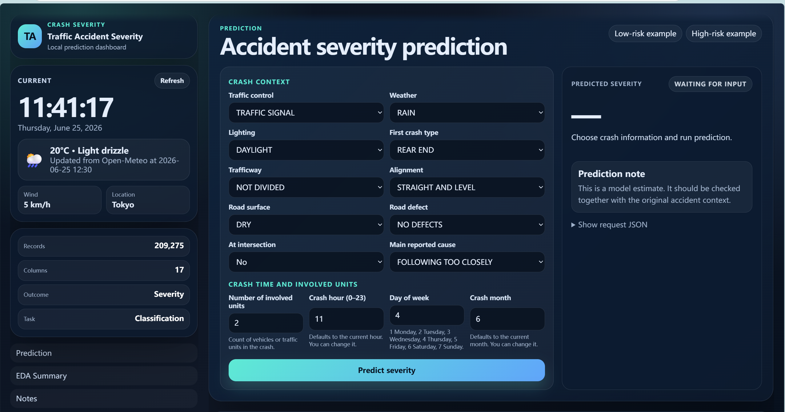
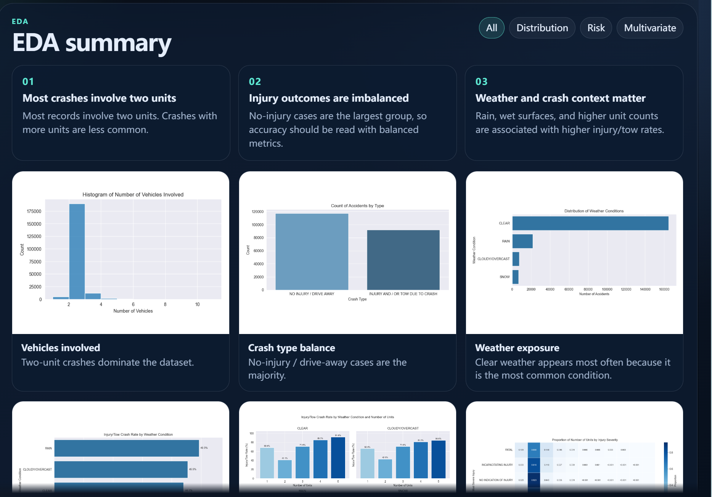

# M6 Web App Deployment Report

## 1. Purpose

The M6 web application was built as a local demonstration system for the traffic accident severity prediction project. Its purpose is twofold:

1. Provide a prediction-system experience where a user can enter crash conditions and receive a predicted injury-severity class.
2. Present key project findings in a dashboard format so the page can also support the final class demonstration and project presentation.

This design choice is important because the project is not only a modelling exercise. The final deliverable needs to show how the trained model could fit into an operational workflow while still communicating the dataset, modelling results, EDA findings, and limitations to stakeholders.

The web app is located in:

`M6_Final_Deployment_Report_Presentation/deployment/web_app/`

## 2. System Design Rationale

The page combines a prediction interface with a reporting dashboard.

The left sidebar creates the feeling of a live prediction system. It displays the current time, date, weather, wind, and location. This information is not only decorative. Time and weather are also relevant model inputs, so the page uses the same real-world context to help pre-fill the prediction form.

The main workspace contains the operational prediction workflow. Users select accident context fields such as traffic control, weather, lighting, crash type, road surface, road defects, intersection involvement, reported cause, number of units, crash hour, day of week, and month. After submission, the dashboard returns the predicted severity label, confidence value, and class probabilities for `NO_INJURY`, `MINOR_INJURY`, and `SEVERE_INJURY`.

The lower dashboard sections support presentation and interpretation. They show EDA images, model performance values, and limitation notes. This makes the web page useful both as a model demo and as a compact project summary.

<p align="center">
  
</p>

**Main interface screenshot:** The prediction page shows the live time/weather sidebar on the left, the accident-context input form in the center, and the prediction result panel on the right. This layout supports both operational prediction and live presentation.

## 3. Real-Time Defaults

One M6 design goal was to make the web app behave like a realistic prediction system instead of a static form. Therefore, the prediction form automatically fills several fields using the user's current context:

| Field | Default source | Implementation |
|---|---|---|
| `crash_hour` | Current system hour | JavaScript reads `new Date().getHours()` when the page loads |
| `crash_day_of_week` | Current system day | JavaScript converts the browser day value to the model's 1-7 day encoding |
| `crash_month` | Current system month | JavaScript reads `new Date().getMonth() + 1` |
| `weather_condition` | Current weather if available | The browser calls Open-Meteo and maps weather codes to model categories |

The left sidebar displays the same current time and weather so users can see why those defaults were selected. If browser geolocation is allowed, the weather request uses the local coordinates. If geolocation is unavailable or denied, the interface falls back to a default location and still keeps the page usable. If weather access fails completely, the form remains editable and the user can manually choose a weather condition.

The form also tracks manual edits. Once a user changes a field, automatic updates avoid overwriting that user's input unless a sample scenario is explicitly selected.

## 4. Application Architecture

The deployment is intentionally lightweight and local. It uses a static front end plus a small Python HTTP server.

| Component | File | Role |
|---|---|---|
| HTML entry point | `index.html` | Defines the dashboard layout, prediction form, EDA section, and limitations section |
| CSS styling | `assets/css/styles.css` | Provides the visual design, responsive layout, cards, forms, and probability bars |
| Front-end logic | `assets/js/app.js` | Handles time/weather defaults, form rendering, API calls, demo fallback, EDA filters, and result rendering |
| Local server | `server.py` | Serves static files and exposes prediction/status/schema API endpoints |
| Dependencies | `requirements.txt` | Lists Python packages required for local model inference |
| Saved model artifacts | `M5/model_outputs/` | Stores the FT-Transformer model, scaler, category maps, and training summary |
| Preprocessing metadata | `data/processed/M5/` | Stores feature definitions, target mapping, medians, rare categories, and schema metadata |

The app starts with:

```bash
cd M6_Final_Deployment_Report_Presentation/deployment/web_app
pip install -r requirements.txt
python server.py
```

The default port is `8090`. If that port is unavailable, the server searches the next available port in the range.

## 5. Backend API

The Python server provides three main endpoints:

| Endpoint | Method | Purpose |
|---|---|---|
| `/api/status` | `GET` | Reports whether the real FT-Transformer model or demo mode is active |
| `/api/schema` | `GET` | Returns the model input schema so the front end can render fields from saved metadata |
| `/api/predict` | `POST` | Accepts a crash-context JSON object and returns prediction results |

The schema endpoint is especially useful because it keeps the front end aligned with the saved model artifacts. Categorical options, numeric ranges, default medians, and output labels are read from the M5 metadata rather than being treated as disconnected hard-coded documentation.

## 6. Model Integration

When the saved model files are available, the server loads the final M5 FT-Transformer model. The backend uses:

- `ft_transformer_model.pt` for neural model weights and model configuration.
- `ft_numeric_scaler.joblib` for numeric feature scaling.
- `ft_category_maps.json` for categorical encoding.
- `training_summary.json` for selected model and tuning metadata.
- `preprocessing_metadata.json` for feature lists, rare-category handling, target labels, and numeric medians.

Before prediction, the server applies the same preprocessing logic used in M5:

1. Normalize text fields.
2. Map missing or unknown categorical values to the model's missing/rare-category representation.
3. Fill numeric missing values with training medians.
4. Validate numeric ranges for hour, day, month, and number of units.
5. Recreate engineered time features such as weekend flag and cyclic hour/day/month features.
6. Scale numeric features and encode categorical features.
7. Run the FT-Transformer and return class probabilities.

The returned labels follow the final three-class M5 target:

| Output label | Meaning |
|---|---|
| `NO_INJURY` | No indication of injury |
| `MINOR_INJURY` | Reported/not evident or non-incapacitating injury |
| `SEVERE_INJURY` | Incapacitating or fatal injury |

## 7. Demo and Fallback Mode

The web app is designed to remain demonstrable even if the full model environment is unavailable. If the model files or required Python libraries cannot be loaded, the server switches to a transparent demo predictor. If the browser cannot reach the server prediction endpoint, the front end also has a browser-side heuristic fallback.

The interface clearly labels these cases as demo mode. This avoids presenting heuristic predictions as real model output while still allowing the class presentation to show the user workflow, form design, probability display, and dashboard interaction.

This fallback design was useful for deployment robustness because local classroom demos can fail for practical reasons such as missing packages, blocked browser permissions, model file path issues, or port conflicts.

## 8. Dashboard and Presentation Features

The web app includes several stakeholder-facing elements:

| Feature | Purpose |
|---|---|
| Live time/weather sidebar | Makes the interface feel like an operational prediction tool and explains default time/weather inputs |
| Prediction form | Allows users to test specific crash scenarios |
| Low-risk and high-risk examples | Provides quick scenarios for demonstration |
| Probability bars | Shows class uncertainty instead of only a single label |
| Request JSON panel | Makes the submitted model input transparent |
| Model status indicator | Shows whether predictions use the real model or demo mode |
| EDA summary cards and charts | Connects deployment back to exploratory findings |
| Model limitation notes | Communicates known risks, especially weak severe-class recall |

The dashboard therefore supports both technical and non-technical audiences. Technical reviewers can inspect request data and model status, while non-technical stakeholders can understand the prediction result, probability distribution, EDA patterns, and limitations.

<p align="center">
  
</p>

**EDA dashboard screenshot:** The EDA section summarizes the main exploratory findings inside the deployed web page. The filter buttons and chart cards make the deployment useful as a project demonstration, not only as a prediction form.

## 9. Limitations

The M6 deployment is a local demo rather than a production web service.

First, it does not include authentication, logging, database storage, or secure production hosting. It is meant for classroom demonstration and local review.

Second, model predictions remain limited by the M5 model. Severe-injury cases are rare and difficult to detect, so the app should not be interpreted as an emergency triage system.

Third, the weather default depends on browser permissions and external weather access. If the browser blocks location or the weather API is unavailable, the user must manually choose the weather value.

Fourth, the dashboard uses records and categories from the project dataset. A real deployment in another city or reporting system would need retraining, validation, and possibly new feature mappings.

Finally, the EDA charts are static images. They are appropriate for presentation, but a production analytics dashboard would likely use interactive filtering connected to a database.

## 10. Conclusion

M6 converts the M5 prediction model into a usable local web app and combines it with a concise project dashboard. The most important design decision was to make the page feel like a prediction system while also supporting final presentation needs. The live time/weather panel, automatic default input filling, model-backed prediction API, probability display, EDA section, and limitation notes all support that goal.

The deployment demonstrates how the traffic accident severity model could be used in an applied workflow, while clearly communicating that the current system is a prototype and that severe-injury prediction remains the main modelling limitation.
