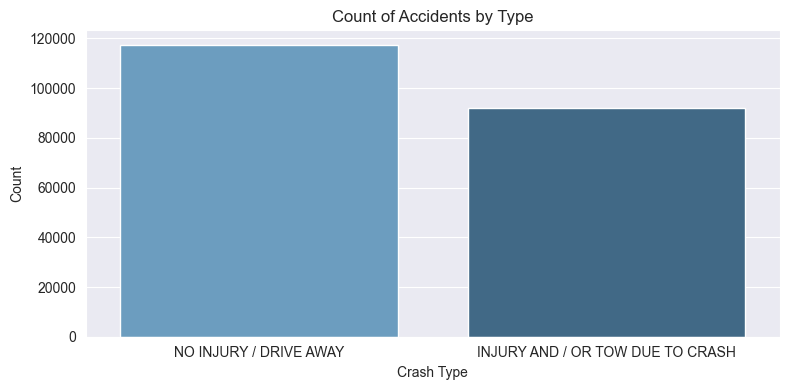
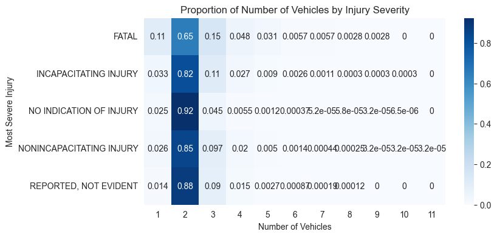
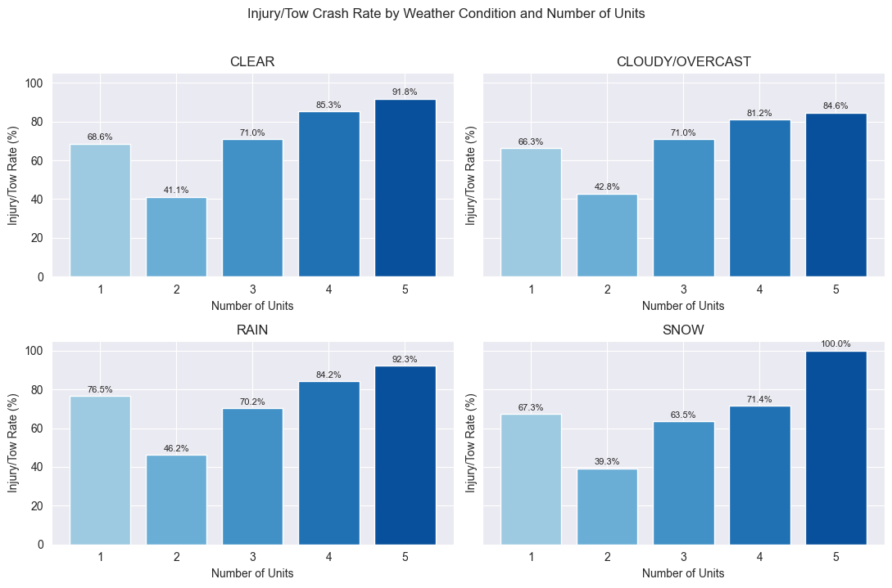
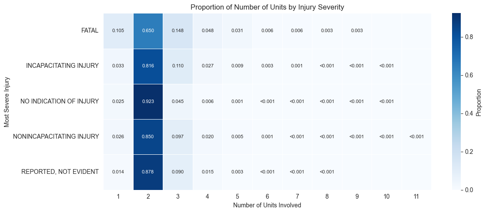

# Traffic Accident Severity Prediction: Full Written Report

## Abstract

This project studies whether traffic accident severity can be predicted from recorded crash conditions such as weather, lighting, road surface, traffic control, crash type, reported contributing cause, time, and number of involved units. The project uses a public Kaggle traffic accidents dataset with 209,306 raw records and 24 attributes. After preprocessing, 31 exact duplicate rows were removed, producing 209,275 cleaned records.

The project developed through six stages. The proposal defined the public safety motivation and the main scientific question. The acquisition and preprocessing stage converted the raw CSV into cleaned and model-ready datasets while removing leakage-prone outcome fields. The exploratory data analysis stage identified class imbalance, crash-context patterns, weather associations, and the need for multi-feature modelling. The modelling stage then trained CatBoost, XGBoost, and an FT-Transformer-style tabular neural model on a final three-class injury severity target. The original five injury labels were reduced to `NO_INJURY`, `MINOR_INJURY`, and `SEVERE_INJURY` because the fatal-only class was extremely small and unstable for direct five-class modelling. The final selected model was the FT-Transformer, which achieved the highest test macro F1 among the compared models, although severe-injury recall remained weak.

The final deployment stage converted the selected model into a local web application. The web app is both a prediction interface and a compact project dashboard. It automatically fills prediction time fields from the current system time and attempts to map current weather into the model's weather input, making the interface feel closer to a real prediction system while still supporting class presentation and reporting.

## 1. Project Motivation and Problem Definition

Traffic accidents are a major public safety problem because they can lead to injuries, fatalities, traffic congestion, emergency response pressure, and economic loss. Accident severity is shaped by interacting factors, including crash mechanism, traffic control, weather, lighting, roadway condition, vehicle involvement, and reported contributing causes. A data-driven model cannot replace crash investigation or emergency judgement, but it can help identify patterns associated with more severe outcomes.

The project was motivated by a practical decision question:

> Given the conditions of a traffic accident, can we estimate the likely injury severity level and identify which factors make the accident more dangerous?

This question is relevant to transportation agencies, public safety teams, and emergency planning. If severe crashes are associated with particular combinations of crash type, weather, lighting, or roadway conditions, agencies can use those patterns to inform safety warnings, infrastructure improvement, and resource allocation. However, the project treats the data as observational. The goal is prediction and association, not proof of causality.

The original target variable proposed for the project was `most_severe_injury`, which records the most serious injury category in each crash. The project also explored `crash_type` during EDA because it separates no-injury/drive-away crashes from injury/tow outcomes and helps reveal severity-related patterns. For final modelling, the project returned to `most_severe_injury` and used a three-class injury severity target.

## 2. Data Source and Initial Dataset

The dataset comes from the Kaggle "Traffic Accidents" dataset by Oktay Rdeki. It is a structured CSV dataset with approximately 210,000 records. Each row represents one traffic accident. The dataset includes temporal, roadway, environmental, crash, and injury variables.

| Item | Description |
|---|---|
| Source platform | Kaggle |
| Dataset name | Traffic Accidents |
| Format | CSV |
| Raw rows | 209,306 |
| Raw attributes | 24 |
| Final cleaned rows | 209,275 |

The main feature groups were:

| Feature group | Example variables |
|---|---|
| Temporal context | `crash_date`, `crash_hour`, `crash_day_of_week`, `crash_month` |
| Roadway and traffic control | `trafficway_type`, `alignment`, `roadway_surface_cond`, `road_defect`, `traffic_control_device`, `intersection_related_i` |
| Environmental context | `weather_condition`, `lighting_condition` |
| Crash context | `first_crash_type`, `crash_type`, `prim_contributory_cause`, `num_units` |
| Injury outcomes | `most_severe_injury`, injury count columns |

The injury-count fields were not used as model predictors because they directly describe accident consequences. Including them would create target leakage. The `damage` column was also excluded later because it represents post-crash outcome information, and `crash_type` was excluded from final M5 modelling for the same reason: it is too close to downstream crash outcome status.

## 3. Data Acquisition and Preprocessing

The preprocessing workflow created two main outputs:

| Output | Purpose |
|---|---|
| `data/processed/traffic_accidents_cleaned.csv` | Human-readable cleaned data for inspection and EDA |
| `data/processed/traffic_accidents_model_ready.csv` | One-hot encoded numeric dataset for early machine learning preparation |

The cleaned dataset contains 209,275 rows and 17 columns. The model-ready dataset contains 209,275 rows and 70 columns. Exact duplicate removal was based on the raw dataset rows rather than only selected columns, which avoided accidentally removing distinct accidents that shared the same modelling features.

The major preprocessing steps were:

1. Select relevant predictors and the target.
2. Validate that required columns exist.
3. Add `record_id` for traceability.
4. Standardize column names.
5. Standardize categorical values by trimming whitespace, uppercasing text, and compressing repeated spaces.
6. Convert placeholder strings such as `UNKNOWN`, `NULL`, `NONE`, and blank values into missing values.
7. Convert `num_units` to numeric format.
8. Remove exact duplicate raw records.
9. Drop rows with missing target labels.
10. Fill missing categorical predictors with `MISSING`.
11. Impute missing `num_units` with the median and create a missingness flag.
12. Create anomaly flags for non-positive and high-outlier `num_units`.
13. Group rare categorical levels into `OTHER_RARE`.
14. One-hot encode nominal categorical predictors for the initial model-ready dataset.
15. Label-encode the target for machine learning.

After preprocessing, the cleaned dataset had no missing values. This made it suitable for EDA and reduced avoidable modelling errors from inconsistent category labels.

### 3.1 Data Quality and Class Imbalance

The original five-class `most_severe_injury` target was highly imbalanced:

| Injury class | Rows | Percentage |
|---|---:|---:|
| `NO INDICATION OF INJURY` | 154,767 | 73.95% |
| `NONINCAPACITATING INJURY` | 31,521 | 15.06% |
| `REPORTED, NOT EVIDENT` | 16,073 | 7.68% |
| `INCAPACITATING INJURY` | 6,563 | 3.14% |
| `FATAL` | 351 | 0.17% |

This distribution shaped the modelling strategy. A model trained and evaluated only by accuracy could look strong while mostly predicting the majority no-injury class. The small fatal class was especially problematic because it had too few examples for stable five-class learning. This issue later motivated the three-class target used in M5.

### 3.2 Numeric Feature Treatment

The main numeric feature in the early cleaned dataset was `num_units`. It was concentrated around two units:

| Statistic | Value |
|---|---:|
| Mean | 2.063 |
| Median | 2 |
| Minimum | 1 |
| Maximum | 11 |

The IQR method flagged 14,815 rows as high outliers because most records involved exactly two units. These records were not removed. In accident data, higher unit counts may be rare but meaningful, so the preprocessing pipeline preserved them while marking them for later analysis.

## 4. Exploratory Data Analysis

The EDA stage studied the cleaned dataset to understand distributions, relationships, modelling risks, and possible predictors. The key findings were that most crashes involved two units, no-injury or drive-away outcomes were the majority, weather and road context were associated with injury/tow rates, and no single variable could explain severity by itself.

### 4.1 Outcome Imbalance

The EDA confirmed that less severe outcomes dominate the dataset. This finding was visible both in the injury target and in the related `crash_type` variable.

  

Figure 1 shows that `NO INJURY / DRIVE AWAY` crashes are more common than `INJURY AND / OR TOW DUE TO CRASH`. This supported the proposal-stage concern that accuracy alone would not be sufficient for model evaluation.

### 4.2 Weather and Severity Patterns

Raw accident counts were highest under clear weather because clear weather is common. However, rate-based comparisons were more useful than raw counts. Rain showed a higher injury/tow share than clear weather in the EDA.

  

Figure 2 shows injury/tow crash rate by weather condition. Rain had the highest injury/tow rate among the compared weather categories, suggesting that weather should remain in the modelling feature set. This does not prove that rain causes severity, but it indicates that weather condition is associated with different crash outcome patterns.

### 4.3 Multi-Unit and Multivariate Patterns

The EDA also found that more serious crash outcomes tended to have a slightly higher average number of units and a longer upper tail. The effect was not large enough to explain severity alone, but it mattered when combined with weather and crash context.

  

Figure 3 shows that injury/tow rates generally rise as the number of involved units increases across weather groups. This supported a modelling approach that uses multiple interacting features rather than a single predictor.

  

Figure 4 shows that two-unit crashes dominate all injury categories, but fatal and severe groups have different unit-count patterns than no-injury cases. This finding reinforced the need to model severity as a multi-factor classification problem.

### 4.4 Revised Modelling Direction

The EDA revised the initial hypotheses in several ways. First, `num_units` was useful but insufficient by itself. Second, weather appeared relevant, especially when interpreted by rates rather than counts. Third, engineered flags derived directly from existing variables could be redundant. Fourth, crash outcomes were best treated as the product of several contextual variables.

The EDA report temporarily framed the next modelling question around predicting `crash_type`, but final M5 modelling focused on `most_severe_injury`. This was a reasonable project evolution: `crash_type` helped expose broad severity patterns during exploration, while `most_severe_injury` remained the project's main scientific target for final prediction.

## 5. Final Modelling Dataset and Target Design

For M5, the team built a refined modelling pipeline specifically for injury severity prediction. The pipeline started from the processed records, removed leakage-prone fields, created engineered time features, and split the data into train and test sets.

The final target compressed the original five injury categories into three operational classes:

| Original injury categories | Final modelling class |
|---|---|
| `NO INDICATION OF INJURY` | `NO_INJURY` |
| `REPORTED, NOT EVIDENT`; `NONINCAPACITATING INJURY` | `MINOR_INJURY` |
| `INCAPACITATING INJURY`; `FATAL` | `SEVERE_INJURY` |

This change was important. The original fatal class accounted for only 0.17% of cleaned records, and direct five-class modelling produced unstable minority-class results. Grouping fatal and incapacitating injuries into `SEVERE_INJURY` preserved the high-impact severity signal while giving the model a more learnable target.

The final train/test split was stratified:

| Split | Rows | Share |
|---|---:|---:|
| Training | 167,420 | 80% |
| Test | 41,855 | 20% |

The three-class target was still imbalanced:

| Class | Train rows | Test rows | Test share |
|---|---:|---:|---:|
| `NO_INJURY` | 123,814 | 30,953 | 74.0% |
| `MINOR_INJURY` | 38,075 | 9,519 | 22.7% |
| `SEVERE_INJURY` | 5,531 | 1,383 | 3.3% |

The final predictors included categorical accident context and numeric/time variables:

| Predictor type | Variables |
|---|---|
| Categorical | traffic control, weather, lighting, first crash type, trafficway type, alignment, road surface, road defect, intersection status, primary contributory cause |
| Numeric/time | number of units, crash hour, day of week, month, weekend flag, cyclic hour/day/month features |

The pipeline excluded `crash_type`, `damage`, and injury-count variables to reduce leakage. This made the modelling setup more realistic because the model used accident context rather than post-outcome fields.

## 6. Model Development

Three model families were trained and compared: CatBoost, XGBoost, and an FT-Transformer-style attention model.

| Model | Reason for inclusion |
|---|---|
| CatBoost | Strong for tabular data with categorical variables and useful for feature importance |
| XGBoost | Widely used gradient boosting baseline for structured data with one-hot encoded features |
| FT-Transformer-style model | Neural tabular model using categorical embeddings and attention-based feature interactions |

Each model was evaluated with imbalance-aware metrics. Macro F1 was the primary selection metric because it gives equal weight to each class and does not let the majority `NO_INJURY` class dominate the evaluation.

### 6.1 Imbalance Handling

Several imbalance-handling decisions were used together:

| Step | Purpose |
|---|---|
| Three-class target aggregation | Avoid unstable fatal-only prediction while preserving severe/fatal meaning |
| Stratified train/test split | Preserve class proportions in training and test sets |
| Rare category grouping | Reduce instability from very small categorical levels |
| Class-weight search | Compare different strengths of minority-class emphasis |
| FT-Transformer focal loss | Emphasize difficult examples during neural model training |
| Probability multiplier calibration grid | Check whether post-training class decision thresholds improved macro F1 |

The training split produced fully balanced weights of approximately 0.451 for `NO_INJURY`, 1.466 for `MINOR_INJURY`, and 10.090 for `SEVERE_INJURY`. The modelling notebook searched `weight_alpha` values of 0.5, 0.75, and 1.0. The best validation setting for all three model families was `weight_alpha = 0.75`. Fully balanced weighting at 1.0 over-corrected the class imbalance and reduced validation macro F1.

Random oversampling and synthetic sampling were not used in the final pipeline because the dataset contains many categorical crash-context features. Synthetic combinations of categorical accident conditions can be difficult to justify operationally and may create unrealistic crash profiles. The final approach relied on aggregation, class weighting, focal loss, stratification, and calibration checks instead.

## 7. Model Evaluation Results

The final test results are shown below. Raw and calibrated versions produced the same saved scores, so the table uses the raw model rows for readability.

| Model | Accuracy | Balanced accuracy | Macro precision | Macro recall | Macro F1 | Weighted F1 | Training seconds |
|---|---:|---:|---:|---:|---:|---:|---:|
| FT-Transformer | 0.7250 | 0.4844 | 0.4810 | 0.4844 | 0.4807 | 0.7196 | 260.64 |
| CatBoost | 0.7215 | 0.4802 | 0.4775 | 0.4802 | 0.4786 | 0.7210 | 529.14 |
| XGBoost | 0.7176 | 0.4648 | 0.4638 | 0.4648 | 0.4643 | 0.7180 | 165.49 |

  

Figure 5 compares model performance using accuracy, balanced accuracy, and macro F1. FT-Transformer achieved the highest test macro F1 and balanced accuracy, so it was selected as the final model. CatBoost was close and had slightly higher weighted F1, but it required more training time. XGBoost trained fastest but had lower balanced accuracy and macro F1.

### 7.1 Class-Level Performance

The selected FT-Transformer performed much better on no-injury cases than on minority injury classes:

| Class | Precision | Recall | F1-score | Support |
|---|---:|---:|---:|---:|
| `NO_INJURY` | 0.8276 | 0.8586 | 0.8428 | 30,953 |
| `MINOR_INJURY` | 0.4309 | 0.3624 | 0.3937 | 9,519 |
| `SEVERE_INJURY` | 0.1845 | 0.2321 | 0.2056 | 1,383 |

  

Figure 6 shows that the model is reliable mainly for the majority `NO_INJURY` class. Severe-injury recall is only 0.2321, meaning the model identifies about 23% of actual severe-injury cases in the test set. This is the most important modelling limitation.

### 7.2 Feature Importance

CatBoost feature importance was used as an interpretable reference even though FT-Transformer was the final selected model.

  

Figure 7 indicates that `first_crash_type` is the strongest feature, followed by `prim_contributory_cause`, `trafficway_type`, and `num_units`. This aligns with the project hypothesis that crash mechanism and contextual crash information are more predictive than a single environmental variable.

### 7.3 Confusion Matrix

  

Figure 8 shows that most no-injury cases are correctly predicted, but many minor and severe injury cases are misclassified as no injury or minor injury. This matters because the practical cost of missing severe cases is much higher than the cost of incorrectly flagging a lower-risk case. Therefore, the current model should be treated as a prototype and not as a stand-alone safety decision tool.

## 8. Deployment and Web Application

M6 converted the selected model into a local web application in:

`M6_Final_Deployment_Report_Presentation/deployment/web_app/`

The web application was designed with two goals:

1. It should feel like a working accident severity prediction system.
2. It should also serve as a presentation dashboard that summarizes the project.

This dual purpose explains the structure of the interface. The left sidebar displays live current time, date, weather, wind, and location. The main area contains the prediction form and result display. The lower dashboard includes EDA charts, model metrics, and limitation notes.

  

Figure 9 shows the main prediction screen. The left panel displays current time and weather, the center panel collects crash-context inputs, and the right panel is reserved for predicted severity, confidence, probability bars, and prediction notes. This screenshot illustrates the intended balance between a realistic prediction-system interface and a clear classroom demonstration layout.

### 8.1 Real-Time Prediction Defaults

The web app automatically fills several prediction inputs using the user's current context:

| Model input | Default source |
|---|---|
| `crash_hour` | Current system hour from the browser |
| `crash_day_of_week` | Current system day converted into model day encoding |
| `crash_month` | Current system month |
| `weather_condition` | Current weather if browser location and Open-Meteo access are available |

This design makes the page more realistic. If the system were used as a live support tool, time and weather would naturally come from the current environment rather than requiring manual entry. The dashboard also shows the current time and weather on the left so users can understand why those values were selected.

If browser geolocation is unavailable, the page falls back to a default weather location. If weather access fails completely, the user can still manually choose a weather category. The front end also tracks user edits so that automatic defaults do not overwrite fields the user has already changed.

  

Figure 10 shows the EDA summary section inside the deployed web page. This section carries the project findings into the interface by showing concise insight cards, filter buttons, and chart cards for distribution, risk, and multivariate patterns.

### 8.2 Local Application Architecture

The deployment uses a simple local architecture:

| Component | File | Role |
|---|---|---|
| HTML | `index.html` | Dashboard layout, prediction form, EDA and limitation sections |
| CSS | `assets/css/styles.css` | Visual styling and responsive layout |
| JavaScript | `assets/js/app.js` | Form rendering, current time/weather defaults, API calls, EDA filters, result display |
| Python server | `server.py` | Static file serving and prediction API |
| Requirements | `requirements.txt` | Python dependencies |
| Model artifacts | `M5/model_outputs/` | Saved FT-Transformer model, scaler, category maps, and training summary |
| Metadata | `data/processed/M5/` | Feature lists, target mappings, medians, rare-category rules |

The server exposes three main API endpoints:

| Endpoint | Method | Purpose |
|---|---|---|
| `/api/status` | `GET` | Reports whether the real FT-Transformer or demo mode is active |
| `/api/schema` | `GET` | Returns model input fields and options from saved metadata |
| `/api/predict` | `POST` | Accepts crash-context JSON and returns predicted label and probabilities |

When model artifacts are available, the server loads the FT-Transformer checkpoint, numeric scaler, category maps, and preprocessing metadata. The server then applies the same feature preparation used in M5: text normalization, rare-category handling, numeric imputation, range validation, time feature creation, scaling, categorical encoding, and neural model inference.

### 8.3 Demo and Fallback Mode

The web app includes fallback behavior. If saved model files or Python dependencies cannot be loaded, the server switches to a transparent demo predictor. If the browser cannot reach the server prediction endpoint, the front end can use a browser-side heuristic fallback. The interface labels these cases as demo mode so users do not confuse heuristic output with real model predictions.

This is useful for classroom presentation because local demonstrations can fail for practical reasons such as package problems, blocked browser permissions, model path issues, or port conflicts. The fallback mode preserves the ability to show the workflow while keeping the source of predictions clear.

## 9. Ethical Considerations and Limitations

The project has several important limitations.

First, the dataset contains recorded accidents only. Minor or unreported crashes may be missing, so the data may not represent all traffic accidents. The model learns from reporting patterns as well as from crash patterns.

Second, the target is highly imbalanced. Even after reducing five classes to three, severe injuries remain rare. This is why the final model performs much better on no-injury cases than on severe cases.

Third, the model is predictive, not causal. Feature importance and EDA charts show associations, but they do not prove that a factor causes injury severity. For example, rain may be associated with higher injury/tow rates, but the dataset alone cannot isolate all confounding variables.

Fourth, some predictor categories are broad or ambiguous, including `OTHER`, `MISSING`, and `UNABLE TO DETERMINE`. These categories can hide important variation.

Fifth, the final model should not be used as a stand-alone emergency triage tool. Severe-injury recall is too low for high-stakes deployment. Human judgement, additional validation, and stronger recall-focused tuning would be required before any operational use.

Sixth, the current deployment is local. It does not include production hosting, authentication, audit logging, database integration, monitoring, privacy controls, or model drift detection.

Finally, the evaluation uses a random stratified split. A stronger deployment evaluation should test temporal generalization, geographic generalization, rare-event subgroups, and sensitivity to reporting changes.

## 10. Future Work

Several improvements would make the project stronger:

1. Tune decision thresholds specifically for severe-injury recall.
2. Evaluate temporal splits to test whether the model generalizes across time.
3. Add geographic or roadway-location features if available.
4. Test calibrated probability quality with reliability curves or expected calibration error.
5. Explore cost-sensitive evaluation where severe-injury misses receive higher penalty.
6. Compare additional interpretable models and SHAP-based explanations.
7. Improve the web app with saved cases, scenario comparison, and clearer uncertainty communication.
8. Deploy the app in a controlled hosted environment only after adding monitoring, logging, security, and validation.

## 11. Conclusion

The project demonstrates an end-to-end traffic accident severity prediction workflow. It began with a public safety question, converted a raw public dataset into cleaned and model-ready data, used EDA to identify imbalance and contextual severity patterns, trained and compared multiple models, and deployed the selected model in a local web application.

The strongest modelling result came from the FT-Transformer-style tabular neural model, which achieved the highest macro F1 and balanced accuracy among the compared candidates. However, the class-level evaluation shows that the model still struggles with severe injuries. This is not a minor detail; it is the central limitation of the project. The current model can support broad exploratory prediction and demonstration, but it is not reliable enough for high-stakes severe-injury detection.

The final web app is valuable because it connects the model to a realistic interface. The live time/weather sidebar and automatic default inputs make the system feel closer to an operational predictor, while the EDA and limitation sections keep the presentation grounded in the evidence and risks. Overall, the project shows that traffic accident severity prediction is feasible as a prototype, but responsible use requires stronger severe-case performance, additional validation, and careful human oversight.
